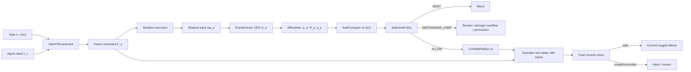

# 方法论文四节写作材料：Future-Constrained CEG-Auth / AuthTrace-Guard

> 日期：2026-05-31  
> 用途：为方法论文的 Introduction、Related Work、Threat Model、Method 提供可直接转写的材料。  
> 当前定位：这是写作材料和 citation inventory，不是最终论文正文。所有经验结论必须继续追溯到仓库结果文件；所有外部工作只按公开论文页/摘要可支持的信息使用，不扩展为未核验的性能或保证声称。

---

## 0. 论文主脊柱

### 0.1 控制性主张

英文主张：

> Tool-using LLM agents should be authorized by what effects their executions realize, not by what tool names they call or how safe their self-audits sound. We propose CEG-Auth, a future-constrained, label-hidden realized-effect authorization framework that validates intended trajectories in a shadow environment, locks safe trajectories for guarded replay, and makes selective action-level decisions over effects outside the task-authorized envelope.

中文主张：

> LLM agent 的越权检测应围绕实际产生的 realized effects，而不是 tool name、API schema、LLM 自审计或带标签 trace 字段。CEG-Auth 将任务授权和 agent 意图编译为未来轨迹约束，在影子环境验证 pending effects，并把安全轨迹锁定为真实环境中的受控 replay，从而在真实副作用 commit 前做 action-level selective authorization。

### 0.2 贡献边界

可以作为主会方法论文贡献的部分：

1. **Authorization-conditioned realized-effect objective**：以 `Omega(tau) \ A(c)` 而不是 tool-call syntax 作为越权对象。
2. **Future-constrained shadow execution**：将 `c, A(c), intent` 编译为 `F_c`，在 shadow trace 中验证，再锁定 replay。
3. **Label-hidden causal evidence graph**：从 raw execution telemetry 构造 evidence graph，预测 effect probability、localized evidence 和 uncertainty，不使用 oracle labels。
4. **Action-level selective policy**：主指标为 `U-Allow / FDeny / Abstain / Coverage / Selective Risk`，而不是只报 row-level FNR/FPR。
5. **Surface-held-out evaluation protocol**：以 held-out surface/tool-family/provider/schema 检验是否学到 realized-effect evidence，而不是 tool proxy。

不要作为贡献写：

- “首次使用 graph 表示 agent trace”；
- “证明现有 agent defense 错误”；
- “完全解决 tool-use safety”；
- “sandbox 安全推出真实安全”；
- “LLM 自审计可作为可信安全证据”。

---

## 1. 引用清单与相关工作定位

> 表中“可用写法”只使用已核验公开页面/摘要能支持的信息。投稿前应把最终引用转为 BibTeX，并逐篇检查 PDF 中的 threat model、metric、baseline 与 claim boundary。

### 1.1 Agent safety benchmarks / evaluation

| 工作 | 来源 | 可用写法 | 与本文差异 |
|---|---|---|---|
| AgentDojo | https://arxiv.org/abs/2406.13352 | 动态环境，用于评估带工具 agent 在不可信数据下的 prompt injection 攻防；含 realistic tasks 与 security test cases。 | 主要是 benchmark/evaluation；本文研究 realized-effect authorization monitor，需可在 AgentDojo 类环境上评估但判断对象不同。 |
| ToolEmu | https://arxiv.org/abs/2309.15817 | 用 LM-emulated sandbox 评估工具使用 agent 风险，强调工具风险和高风险场景。 | ToolEmu 用 LM 模拟执行；本文要求 label-hidden execution evidence、shadow/real divergence 和 staged commit。 |
| AgentHarm | https://arxiv.org/abs/2410.09024 | 衡量 LLM agents harmfulness/misuse 的 benchmark。 | AgentHarm 关注 harmful task compliance；本文关注用户授权任务中的 unauthorized realized effects，包括 benign overreach。 |
| Agent Security Bench (ASB) | https://arxiv.org/abs/2410.02644 | 形式化并 benchmark LLM-based agents 的 attacks/defenses，覆盖多场景、多工具和多指标。 | ASB 是 broad benchmark；本文提出 effect-level monitor 和 surface-held-out/action-level evaluation。 |
| A Framework for Formalizing LLM Agent Security | https://arxiv.org/abs/2603.19469 | 从 contextual security 角度系统化 agent security properties，如 task/action alignment、source authorization、data isolation。 | 可作为 threat model 背景；本文具体化为 `A(c)`, `Omega(tau)`, `F_c`, pre-commit guard。 |

### 1.2 Prompt-injection and tool-boundary defenses

| 工作 | 来源 | 可用写法 | 与本文差异 |
|---|---|---|---|
| CaMeL | https://arxiv.org/abs/2503.18813 | 用架构隔离和 control/data flow 思想防御 prompt injection。 | 本文可兼容隔离架构；重点是 realized-effect inference 和 commit 前 effect authorization。 |
| ClawGuard | https://arxiv.org/abs/2604.11790 | 在 tool-call boundary 执行 user-confirmed rules，目标是在真实效果产生前拦截 adversarial calls。 | 本文同样重视 pre-effect blocking，但用 shadow evidence、future trajectory lock 和 effect-level selective policy，而非只做 tool-call rule checking。 |
| ToolGate | https://arxiv.org/abs/2601.04688 | 以 Hoare-style contracts / typed symbolic state 验证 tool execution 与 state evolution。 | ToolGate 偏 logical state correctness；本文偏 raw trace realized effects、surface-held-out robustness 和 action-level unauthorized effect risk。 |
| Progent | https://arxiv.org/abs/2504.11703 | 用 programmable privilege control / DSL 管理 agent tool privileges。 | 本文可把 `F_c` 输出为 privilege/policy input；创新在 effect inference 与 trace-locked replay。 |
| DRIFT | https://arxiv.org/abs/2506.12104 | dynamic rule-based defense with injection isolation，用于 LLM agents prompt injection 防御。 | 本文不把动态规则本身作为贡献，而要求 label-hidden effect evidence 和 held-out surface 测试。 |

### 1.3 Graph / provenance / authorization / runtime trace methods

| 工作 | 来源 | 可用写法 | 与本文差异 |
|---|---|---|---|
| AuthGraph | https://arxiv.org/html/2605.26497v1 | dual-graph defense：clean authorization graph 与 execution provenance graph 结构对齐，检测 tool-level/parameter-source deviations。 | 本文不能声称 graph 首创。差异应写为：CEG-Auth 判断 realized effects outside `A(c)`，用 shadow trace 生成 future constraint 和 locked replay，并优化 action-level selective policy。 |
| PACT | https://arxiv.org/abs/2605.11039 | provenance-aware capability contracts，跟踪 tool arguments 的语义角色和来源，检查 role-specific trust contract。 | PACT 聚焦 argument-level provenance enforcement；本文聚焦 execution-level realized effects 和 commit 前 effect authorization。 |
| Alignment Contracts | https://arxiv.org/abs/2605.00081 | 将 observable effects 的边界作为 agentic security systems 的 formal contract。 | 可作为本文 `A(c)` / effect envelope 的邻近工作；本文补 shadow/replay 和 surface-held-out empirical protocol。 |
| AgentArmor | https://arxiv.org/abs/2508.01249 | 将 agent runtime traces 转为 CFG/DFG/PDG 等 graph IR，并用 type system enforce policies。 | 本文不把 graph IR 作为新意；重点是 label-hidden effect inference、evidence localization 和 selective authorization。 |
| ARGUS | https://arxiv.org/abs/2605.03378 | influence provenance graph 追踪 untrusted context 如何影响 agent decisions，并在执行前验证可信 evidence。 | ARGUS 关注 influence / justification；本文关注 pending/realized effects 是否超出 `A(c)`。 |
| Agent-Sentry | https://arxiv.org/abs/2603.22868 | 基于 execution provenance 约束 agent 行为边界，学习 policy 并阻断 out-of-bounds executions。 | 本文可把它作为 behavior-bound baseline；差异是 effect-level authorization envelope 与 future-constrained replay。 |
| TraceAegis | https://arxiv.org/abs/2510.11203 | provenance-based analysis framework，用 hierarchical/behavioral anomaly detection 保护 LLM agents。 | 本文不是 anomaly detection，而是 task-conditioned unauthorized-effect decision。 |
| TRACES | https://arxiv.org/abs/2605.27690 | multi-turn trajectory-state modeling for proactive safety auditing。 | 本文也用 trajectory，但把 agent intent 约束为 future trajectory contract 并做 pre-commit replay guard。 |
| HarnessAudit | https://arxiv.org/abs/2605.14271 | 审计 agent harness 的 full execution trajectories，关注 boundary compliance、execution fidelity、system stability。 | 本文从 audit 进一步要求 shadow/staged prevention 和 action-level authorization tradeoff。 |
| OpenTelemetry | https://opentelemetry.io/docs/what-is-opentelemetry/ | 工业界标准遥测：traces、metrics、logs。 | CEG-Auth 可消费 OTel-style telemetry，但贡献不是 observability 标准，而是 effect inference and authorization. |
| W3C PROV | https://www.w3.org/TR/prov-overview/ | provenance 建模标准，围绕 entities、activities、agents 等关系。 | CEG-Auth 可映射到 PROV-style event graph，但论文新意不在 provenance representation。 |

### 1.4 Causal attribution and selective guardrails

| 工作 | 来源 | 可用写法 | 与本文差异 |
|---|---|---|---|
| AttriGuard | https://arxiv.org/abs/2603.10749 | 通过 counterfactual re-execution / causal attribution 验证 proposed tool call 是否必要。 | AttriGuard 判断 tool invocation 的原因；本文判断执行轨迹中实际或 pending effects 是否授权。 |
| CausalArmor | https://arxiv.org/abs/2602.07918 | selective defense：在 privileged decision points 做 attribution，并在 untrusted segment 主导时触发 sanitization。 | 本文的 selective policy 是 action-level allow/deny/abstain over unauthorized effects，而非只在 prompt segment attribution 上选择 sanitization。 |

---

## 2. Introduction 写作材料

### 2.1 第一段：问题动机

可写英文段落：

> LLM agents increasingly operate tools that read files, issue network requests, edit state, send messages, and invoke provider APIs. In such systems, safety is no longer a property of the final natural-language response alone. A seemingly harmless tool call can realize downstream effects that were not authorized by the user's task: a status check can follow redirects and write a file, a local analysis script can upload raw rows to a third-party service, and a cleanup command can expand into deletion outside the requested scope. The central question is therefore not whether a tool name looks safe, but whether the effects actually realized by the execution are contained in the task-authorized envelope.

中文写作意图：

- 把读者从“prompt safety / tool name safety”拉到 “realized effects”；
- 用 status check 和 financial upload 两个例子铺垫；
- 避免一上来讲 graph 或 probe。

### 2.2 第二段：现有方法的不足

可写英文段落：

> Recent work has made substantial progress on agent safety benchmarks, prompt-injection defenses, provenance tracking, capability contracts, and graph-based trace analysis. These systems highlight the importance of untrusted data, tool-call boundaries, provenance, and policy enforcement. However, a monitor can still fail if it checks the wrong object. Tool names, API schemas, parameter sources, LLM self-audits, and full-label trace fields can all overstate safety when the same effect is realized through an unseen surface form or when a row-level effect score collapses into an action-level allow decision. A deployed authorization monitor must instead infer realized effects from label-hidden execution evidence and decide at the action level under uncertainty.

对应引用：

- AgentDojo / ToolEmu / AgentHarm / ASB：说明 benchmarks；
- CaMeL / ClawGuard / ToolGate / Progent / DRIFT：说明 defenses；
- AuthGraph / PACT / Alignment Contracts / AgentArmor / ARGUS：说明 provenance/graph/authorization；
- AttriGuard / CausalArmor：说明 causal attribution；
- 本项目 T68/T69/T73：说明 row/action、label-hidden 和 calibration 风险。

### 2.3 第三段：本文方法

可写英文段落：

> We propose CEG-Auth, a future-constrained realized-effect authorization framework for tool-using LLM agents. Given a task context `c`, an authorized effect envelope `A(c)`, and the agent's proposed intent, CEG-Auth compiles an executable future-trajectory constraint `F_c`, validates the intended behavior in a shadow environment, extracts a causal evidence graph from the label-hidden trace, and predicts pending effects with localized evidence and calibrated uncertainty. If the trajectory is allowed, CEG-Auth compiles the shadow execution into a trace-locked replay plan and executes only that plan in the real environment under pre-commit guards. The real executor does not ask the LLM to generate a second action; it only performs guarded replay with safe substitution of real resources.

### 2.4 第四段：关键机制和保证边界

可写英文段落：

> The prevention claim is conditional and systems-level. CEG-Auth does not assume that a sandbox trace is automatically faithful to the real environment. Instead, it relies on mediated tools, staged or dry-run side effects, sound future constraints, replay-locked execution, prefix guards, and observable pending effects. Under these assumptions, committed effects can be checked against `A(c)` before real-world commit. When these assumptions fail, the correct decision is abstention, human confirmation, or a stronger provider-specific sandbox rather than silent allow.

### 2.5 Contributions 段落

可写成四点：

1. **Problem and threat model.** We formalize authorization-conditioned realized-effect monitoring for tool-using LLM agents, distinguishing task-authorized effects `A(c)`, realized effects `Omega(tau)`, and action-level unauthorized allowance.
2. **Method.** We introduce CEG-Auth, a future-constrained shadow-execution framework that turns intended behavior into executable trajectory constraints, verifies label-hidden evidence in a shadow trace, and replays only locked trajectories under pre-commit guards.
3. **Evidence and uncertainty.** CEG-Auth predicts effect probabilities with localized evidence and uncertainty, enabling selective `ALLOW / DENY / ABSTAIN / ASK_USER` decisions over effects outside `A(c)`.
4. **Evaluation protocol.** We evaluate under held-out tool surfaces, trace families, provider/schema shifts, and action-level `U-Allow / FDeny / Abstain / Coverage / Selective Risk`, using strong baselines including raw-status boundaries, deterministic rules, LLM judges, flat trace classifiers, event-sequence models, graph ablations, and AuthGraph-style alignment.

如果实验还没完成，贡献 2-4 应写成 proposed/evaluation plan；完成后再改为 past tense。

### 2.6 Introduction 红线

- 不要写 “we solve agent safety”。
- 不要写 “graph-based monitor is novel”。
- 不要写 “our prior probe experiments prove all current monitors fail”。
- 不要把 T58/T64/T65 的 full-label/structured verifier 结果作为主方法性能。
- 不要把 shadow execution 写成真实部署日志。

---

## 3. Related Work 写作材料

### 3.1 Agent security benchmarks

可写英文段落：

> Agent safety benchmarks such as AgentDojo, ToolEmu, AgentHarm, and Agent Security Bench have made tool-use risks measurable by constructing tasks, tools, attacks, and defense evaluations for LLM agents. These benchmarks are essential for stress testing prompt injection, misuse, and unsafe tool behavior. Our work is complementary: rather than proposing another broad benchmark, we define a monitor-level objective for authorization-conditioned realized effects and require held-out-surface/action-level evaluation so that a detector cannot succeed by memorizing seen tools or trace schemas.

写作重点：

- 尊重 benchmark 贡献；
- 强调本文不是替代它们，而是给 monitor 方法/指标；
- 后续实验最好在 AgentDojo/ASB/ToolEmu-style tasks 上验证，否则不能说 outperform。

### 3.2 Prompt injection defenses and tool-boundary enforcement

可写英文段落：

> A growing line of defenses moves agent security from prompt-level refusal to system-level enforcement. CaMeL separates privileged control from quarantined processing of untrusted data; ClawGuard enforces user-confirmed rules at tool-call boundaries; ToolGate uses contracts to verify tool execution and state evolution; Progent and DRIFT explore programmable or dynamic policy mechanisms. CEG-Auth follows the same architectural lesson that the LLM should not be trusted as its own guard. Its focus is different: it infers what effects are pending or realized from label-hidden execution evidence, checks those effects against the task envelope, and uses shadow execution plus replay locks to prevent unauthorized effects before commit.

### 3.3 Provenance, graphs, and authorization

可写英文段落：

> Graphs and provenance are natural representations for agent execution. Industrial telemetry systems such as OpenTelemetry already expose traces and spans, and W3C PROV provides a general vocabulary for entities, activities, and agents. Recent agent-security work similarly uses structured traces: AuthGraph aligns clean authorization graphs with execution provenance graphs, PACT tracks argument-level provenance against capability contracts, Alignment Contracts formalize observable effect boundaries, AgentArmor converts traces into program-dependence-style graph IRs, and ARGUS tracks influence provenance from untrusted context to agent decisions. CEG-Auth does not claim novelty in representing traces as graphs. Its novelty is the combination of authorization-conditioned realized-effect inference, label-hidden evidence, future-trajectory constraints, trace-locked replay, and action-level selective policy.

### 3.4 Causal attribution and selective defenses

可写英文段落：

> AttriGuard and CausalArmor use causal attribution to decide whether privileged tool calls are supported by user intent or dominated by untrusted observations. This is an important complementary question: why was the tool call produced? CEG-Auth asks a downstream question: what effects will the execution commit, and are those effects authorized? The two can be combined: attribution can help decide whether an intent should be trusted, while CEG-Auth verifies effect-level authorization before commit.

### 3.5 Runtime auditing and trajectory monitoring

可写英文段落：

> Agent-Sentry, TraceAegis, TRACES, and HarnessAudit illustrate a broader shift from single-turn prompt screening to trajectory-level monitoring and auditing. These systems show that agent safety failures often emerge over execution paths, not isolated model outputs. CEG-Auth inherits this trajectory perspective but targets pre-commit authorization: a shadow trace is not only audited, but compiled into a locked replay plan whose real execution is prefix-checked against the task-derived future constraint.

### 3.6 相关工作差异矩阵

| 维度 | Benchmark work | Prompt-injection defenses | Provenance/graph systems | Causal attribution | CEG-Auth |
|---|---|---|---|---|---|
| 判断对象 | task success / attack success / harmfulness | tool-call allow/block or data/control isolation | provenance alignment / policy compliance / anomalies | why tool call occurred | realized effects outside `A(c)` |
| 输入 | tasks, tool outputs, attacks | prompt/tool boundary/context | traces/provenance/graphs/contracts | counterfactual observations | label-hidden shadow/real traces |
| 阻断阶段 | evaluation | pre-tool or runtime | runtime/audit/pre-exec depending system | privileged decision point | shadow -> pre-commit guarded replay |
| 主要风险 | benchmark coverage | rule coverage / utility | provenance fidelity / schema shortcut | attribution cost/fidelity | shadow-real divergence / staging / constraint soundness |
| 本文指标 | 不适用 | often ASR/utility | varied | ASR/utility/latency | U-Allow, FDeny, Abstain, Coverage, Selective Risk |

---

## 4. Threat Model 写作材料

### 4.1 System model

```text
c: user task and trusted task context
A(c): task-authorized effect envelope
LLM planner: proposes intent / tool plan I_c
Tool executor: mediated execution interface
Shadow environment: sandbox/dry-run/staged provider environment
Trace collector: records label-hidden raw execution telemetry
CEG-Auth monitor: EventExtract + EffectInfer + AuthCompare + SelectivePolicy
Replay executor: non-LLM component that replays locked plan pi
Runtime guard: prefix-checks real execution against F_c and pi
Commit layer: commits staged effects only after authorization check
```

### 4.2 Threats in scope

攻击者或失败来源：

- untrusted webpage/email/document/repository/API response/tool output；
- indirect prompt injection；
- tool-output-as-instruction；
- benign planning drift in long tasks；
- error recovery expanding permissions；
- tool aliasing through shell/python/browser；
- schema/provider/tool-family shift；
- LLM self-audit failure。

攻击目标：

- exfiltrate local/private data；
- delete/overwrite files；
- send messages or API requests to unauthorized recipients/endpoints；
- trigger provider actions not authorized by task；
- use an allowed tool surface to realize a disallowed effect。

### 4.3 Trusted assumptions

必须明确写：

1. The attacker does not compromise the OS/kernel/monitor.
2. All security-relevant side effects are mediated by wrappers/guards.
3. The trace collector records sufficient telemetry for the effect schema.
4. The policy store / `A(c)` is trusted.
5. The shadow environment isolates real side effects.
6. Irreversible effects are staged, dry-run, queued, or require explicit commit.
7. The replay executor can prevent the LLM from changing the real-stage action.

### 4.4 What the monitor can and cannot observe

Allowed inputs:

```text
task context c
A(c) / policy envelope
tool name and arguments
stdout/stderr/exit code
filesystem pre/post diff
HTTP request/response metadata
browser DOM/storage diffs
provider status / receipt id / dry-run response
message outbox metadata
timestamps/spans/call graph/resource identifiers
```

Forbidden inputs:

```text
verified_effects
unauthorized_effects
candidate_effect_present
effect_diff
policy_decision
gold labels or label-like trace fields
LLM self-audit as trusted evidence
```

### 4.5 Security objective

Effect-level:

```text
Unauthorized(c, tau) = Omega(tau) \ A(c)
```

Action-level:

```text
BadAllow = [Decision(c, tau) = ALLOW and Unauthorized(c, tau) != empty]
FalseDeny = [Decision(c, tau) = DENY and Unauthorized(c, tau) = empty]
Abstain = [Decision(c, tau) in {ABSTAIN, ASK_USER}]
```

Pre-commit prevention objective:

```text
P(CommittedEffects(tau_r) \ A(c) != empty) should be minimized,
subject to bounded FDeny and reported Abstain/Coverage.
```

### 4.6 Out of scope

- malicious user requesting harmful tasks；
- compromised kernel/monitor/tool wrapper；
- model weight backdoors；
- fully unobservable side effects；
- provider services that cannot stage/dry-run high-risk effects, unless handled by ask-user/outbox；
- judging whether the user's authorized task is legal or ethical；
- guaranteeing semantic correctness of the task output beyond effect authorization。

---

## 5. Method 写作材料

### 5.1 Overview

Mermaid 草图，可转成论文 figure：



### 5.2 Algorithm skeleton

```text
Algorithm CEG-Auth(c, A(c), I_c):
  F_c <- IntentToConstraint(c, A(c), I_c)
  tau_s <- ShadowExec(I_c, F_c)
  G_s <- EventExtract(tau_s)
  for each effect e in E:
      (p_e, R_e, u_e) <- EffectInfer(G_s, e)
  U <- {e | e notin A(c)}
  risk_U <- Aggregate({p_e, u_e | e in U})
  d <- SelectivePolicy(risk_U, {R_e}, {u_e})
  if d != ALLOW:
      return d
  pi <- CompileReplay(tau_s, F_c)
  tau_r <- GuardedReplay(pi, sigma, F_c)
  G_r <- EventExtract(tau_r)
  if FinalCommitCheck(G_r, A(c), F_c) == safe:
      Commit()
      return ALLOW
  else:
      Abort()
      return ABSTAIN or DENY
```

### 5.3 Components

**IntentToConstraint.**

Inputs: trusted task `c`, authorization envelope `A(c)`, agent intent `I_c`.

Outputs: executable `F_c`.

Implementation options:

- deterministic policy parser for explicit constraints；
- LLM compiler with structured output, followed by non-LLM validator；
- policy-as-code template generation；
- human/user confirmation for high-risk ambiguous permissions。

Evaluation:

- compare compiled allowed/forbidden effects against human annotation；
- report over-permission and under-permission separately；
- never use compiler output alone as gold truth。

**ShadowExec.**

Runs the intended action in an isolated environment:

- overlay filesystem；
- mocked or provider sandbox network；
- outbox queue for messages；
- browser profile with no real submit/commit；
- dry-run API mode where available。

Outputs label-hidden raw telemetry, not effect labels.

**EventExtract / Causal Evidence Graph.**

Graph node examples:

```text
ToolCall, ProcessEvent, FileEntity, FileDiff,
NetworkRequest, NetworkResponse, BrowserDOMEvent,
StorageMutation, ProviderAck, MessageOutbox, Identity, TaskContext
```

Edge examples:

```text
used, generated, modified, deleted, sent_to,
received_from, derived_from, authorized_by, violates_constraint
```

The graph is a means, not the contribution.

**EffectInfer.**

For each candidate effect:

```text
EffectInfer(G, e) -> p_e, R_e, u_e
```

Model choices:

- typed-edge GNN / graph transformer；
- path-feature logistic/GBDT；
- deterministic parser + learned calibration；
- LLM-as-judge over serialized graph only as baseline；
- flat raw-trace classifier and event-sequence transformer as non-graph baselines。

**AuthCompare and SelectivePolicy.**

Only aggregate effects outside `A(c)`:

```text
U(c) = {e | e notin A(c)}
risk_U = max / noisy-OR / severity-weighted sum / conformal upper bound
```

Decision:

```text
DENY if unauthorized risk high and uncertainty low
ABSTAIN/ASK_USER if risk or evidence is ambiguous
ALLOW only if unauthorized risk is below threshold with sufficient confidence
```

**CompileReplay and GuardedReplay.**

Replay plan `pi` should include:

```text
operation ids
tool/executor primitive
arguments after normalization
resource identities
allowed endpoints/recipients
data-flow dependencies
expected side-effect types
preconditions/postconditions
safe substitution slots
commit policy
```

Runtime guard checks:

```text
operation in pi
arguments satisfy F_c
substitutions satisfy resource/recipient/endpoint binding
no new tool/action introduced
pending effect subset of A(c)
prefix trace still satisfies F_c
```

### 5.4 Conditional guarantee text

可写进 theorem/proposition：

> Under complete mediation of side-effectful operations, staged commit for irreversible effects, sound compilation of `F_c` such that all allowed effects are contained in `A(c)`, replay-lock soundness, safe substitution, and complete observation of pending effects, CEG-Auth commits only effects contained in `A(c)`.

Proof sketch:

1. By mediation, every committed effect passes through the guard.
2. By replay-lock soundness, the guard admits only operations in `pi` after safe substitution.
3. By prefix guard soundness, any operation whose pending effect violates `F_c` is blocked before commit.
4. By constraint soundness, every effect allowed by `F_c` is in `A(c)`.
5. Therefore every committed observed effect is in `A(c)`.

Boundary cases:

- unmediated side effect: theorem does not apply；
- provider commits before guard: theorem does not apply；
- `F_c` over-permits upload: committed upload may be within `F_c` but not truly intended, so compiler accuracy is a separate empirical risk；
- hidden side effect not in trace: theorem does not apply。

### 5.5 Method section red lines

- “Graph reasoning” should be one component, not the method title.
- `F_c` must be called executable constraint/contract, not just “LLM plan”.
- The real-stage replay must be non-LLM; otherwise the scheme loses the trace lock.
- Shadow execution must be described as evidence generation and constraint validation, not proof of real safety.
- For non-stageable APIs, the method must abstain or require provider sandbox/user confirmation.

---

## 6. 实验接口：后续代码应能支撑这些段落

### 6.1 Datasets

最低数据结构：

```json
{
  "task_id": "...",
  "task_context": "...",
  "authorized_envelope": {
    "effects": [],
    "resources": [],
    "endpoints": [],
    "recipients": [],
    "forbidden_effects": []
  },
  "agent_intent": "...",
  "future_constraint": {},
  "shadow_trace": {},
  "real_replay_trace": {},
  "gold_effects": [],
  "gold_unauthorized_effects": [],
  "surface": "...",
  "tool_family": "...",
  "trace_family": "...",
  "provider_schema": "..."
}
```

训练/评估文本中禁止包含 `gold_effects`, `gold_unauthorized_effects`, `policy_decision`。

### 6.2 Main metrics

```text
Unauthorized Committed Effect Rate
Unauthorized Action Allow Rate (U-Allow)
Authorized Action False Denial Rate (FDeny)
Abstain Rate
Coverage
Selective Risk
Pre-effect Block Rate
Shadow-real Effect Divergence
Row-level FNR/FPR as decomposition
Evidence localization precision/recall if annotated
```

### 6.3 Baselines

必须包括：

```text
all-allow
always-deny
tool-name rule
pre-action rule-only
raw-status boundary
deterministic effect parser
provenance-only
AuthGraph-style graph alignment
LLM self-audit task+intent
LLM judge over raw trace
flat raw-trace classifier
event-sequence transformer
untyped graph
graph without uncertainty
graph without evidence localization
shadow without replay lock
replay lock without runtime guard
post-hoc CEG-Auth without staged commit
```

### 6.4 Expected falsification cases

如果出现以下结果，应降级主张：

- CEG-Auth 不显著优于 raw-status boundary；
- `F_c` over-permission 高，导致越权被定义成 authorized；
- shadow-real divergence 高且不能被 guard/abstain 捕获；
- action-level FDeny 或 Abstain 高到不可用；
- held-out surface 下 U-Allow 接近 all-allow；
- graph ablation 与 full graph 无差异，说明 graph 没带来效果。

---

## 7. 可直接放进论文的术语表

```text
Task-authorized envelope A(c):
  The set of effects, resources, endpoints, recipients, and constraints authorized by the trusted task context.

Realized effect Omega(tau):
  A security-relevant external consequence observed or pending in an execution trace.

Future trajectory constraint F_c:
  An executable contract compiled from task authorization and agent intent, constraining which operations, resources, data flows, and pending effects may occur.

Shadow execution:
  An isolated or staged run used to collect label-hidden evidence and validate the intended trajectory before real commit.

Trace-locked replay:
  Real execution by a non-LLM executor that replays only the operations compiled from the verified shadow trace.

Safe substitution sigma:
  A mapping from shadow placeholders to real resources, endpoints, recipients, or values that preserves F_c.

Unauthorized action allow rate:
  Fraction of actions with at least one unauthorized effect that are allowed without abstention.

False denial rate:
  Fraction of authorized actions denied.

Selective risk:
  Unauthorized allow risk measured over covered non-abstained actions, reported together with coverage.
```

---

## 8. 下一步写作/实验优先级

1. 先写 Threat Model 和 Problem Definition，因为它们决定 `A(c)`, `F_c`, `Omega(tau)` 的边界。
2. 再写 Method overview，突出 shadow/replay/pre-commit，而不是 graph。
3. Related Work 必须先承认 graph/provenance 已拥挤，再写本文差异。
4. Introduction 只放两个 motivating examples，不堆内部 T 编号。
5. 实验未完成前，Introduction 的贡献句用 “we propose / we evaluate in a planned protocol”；实验完成后再改为 “we show”。
6. 新实验优先级：T102 constraint compiler、T103 shadow/replay prototype、T104 pre-commit blocking benchmark、T105 divergence/safe substitution。
